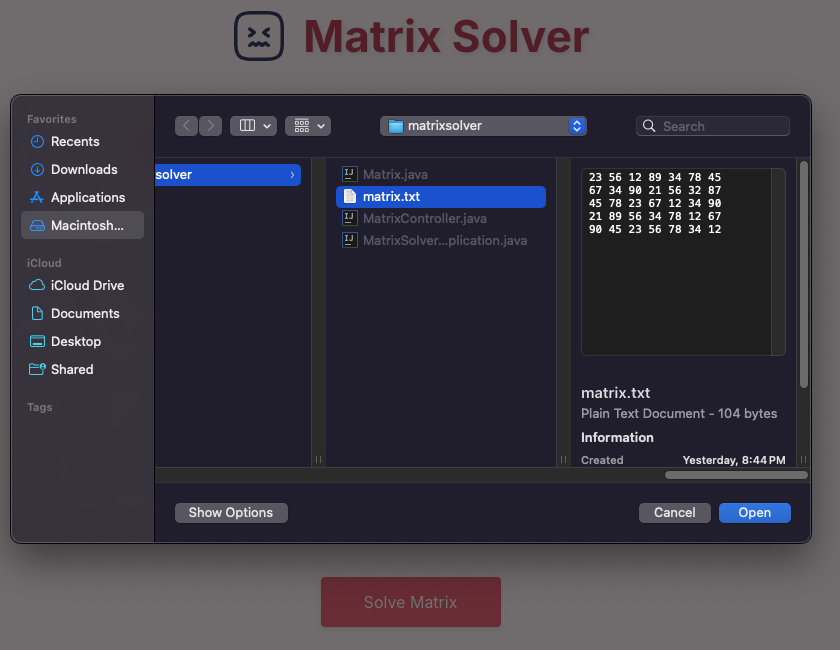
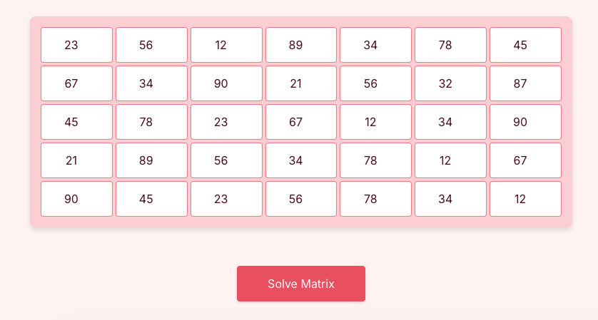
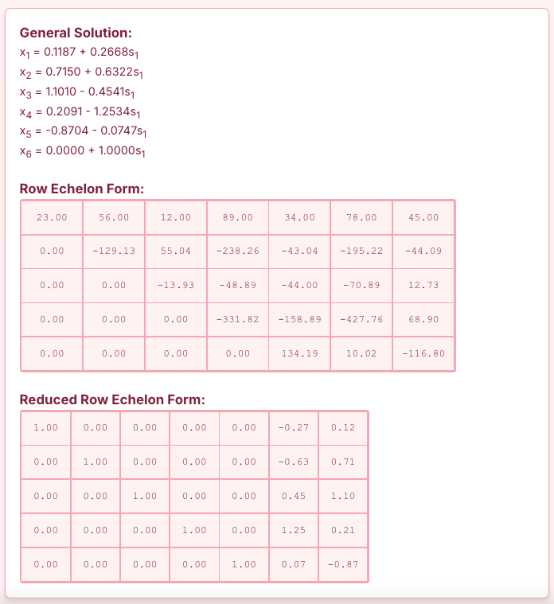

# Matrix Solver

## Overview
The Matrix Solver is a Spring Boot application that allows users to perform various matrix operations, including creating matrices from files, converting them to row echelon form, reduced row echelon form, and finding general solutions to linear equations.

## Features
- Load matrices from a text file.
- Convert matrices to row echelon form and reduced row echelon form.
- Calculate and display the general solution of linear equations.
- Interactive web interface for matrix creation and solving.

## Live Preview
You can try the live version of the Matrix Solver at the following link: [Matrix Solver Live Preview](https://matrix-solver-841939063634.us-central1.run.app/)

## Getting Started

### Prerequisites
- Java Development Kit (JDK) 21 or higher

### Installation
1. Clone the repository:
   ```bash
   git clone https://github.com/KingLiban/Matrix-Solver.git
   cd matrix-solver
   ```

2. Build the project using the Maven wrapper:
   ```bash
   ./mvnw clean install
   ```

### Running the Application
1. Run the Spring Boot application:
   ```bash
   ./mvnw spring-boot:run
   ```

2. Open the web interface in your browser:
   - Navigate to `http://localhost:8080/` (Spring Boot's default port is 8080)

### Usage
- **Create Matrix**: Input the number of rows and columns to create a new matrix.
- **Upload Matrix**: Upload a `.txt` file containing matrix data.
- **Solve Matrix**: Click the button to compute the row echelon form, reduced row echelon form, and general solution.

### Step 1: Upload .txt file


### Step 2: View created matrix


### Step 3: Submit and see answer

## Development
- The main Java classes are located in `src/main/java/com/matrix/matrixsolver/`
- HTML/CSS/JS files are typically located in `src/main/resources/static/`
- To modify the application, edit the relevant files and rebuild the project

## License
This project is licensed under the MIT License. See the LICENSE file for details.